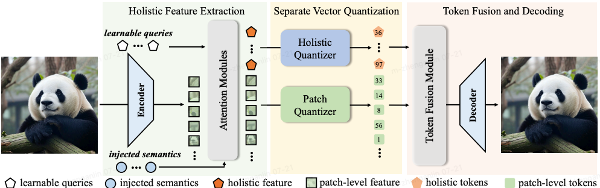
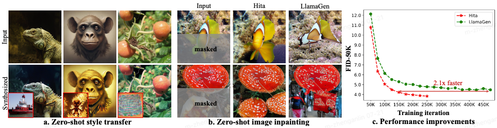

# Holistic Tokenizer for Autoregressive Image Generation

<!-- [[Model Zoo](https://huggingface.co/yexiguafu/hita-gen/tree/main)] -->

[**Holistic Tokenizer for Autoregressive Image Generation**](https://arxiv.org/pdf/2507.02358v4) by
[Anlin Zheng](https://yexiguafuqihao.github.io/), 
[Haochen Wang](https://haochen-wang409.github.io), 
[Yucheng Zhao](https://scholar.google.com/citations?user=QWemjjQAAAAJ&hl=en),
[Weipeng Deng](https://scholar.google.com/citations?user=JBMI5yQAAAAJ&hl=en),
[Tiancai Wang](https://scholar.google.com/citations?user=YI0sRroAAAAJ&hl=en),
[Xiangyu Zhang](https://scholar.google.com/citations?user=yuB-cfoAAAAJ&hl=en), and
[Xiaojuan Qi](https://xjqi.github.io/).

**TL; DR**: We introduce a holistic-to-local tokenization scheme, dubbed as Hita, which uses learnable holistic tokens and local patch tokens to incoporate global information for AR (autoregressive) image generation. Beyond image tokenization, Hita emerges with new features such as zero-shot style transfer and zeros-shot image in-painting. Besides, It also exhibits the capability of accelerating convergence speed during training and significantly improves the synthesis quality.

> **Abstract.** Vanilla autoregressive image generation models generate visual tokens step-by-step, limiting their ability 
> to capture holistic relationships among token sequences. Moreover, because most visual tokenizers map local image patches 
> into latent tokens, global information is limited. To address this, we introduce Hita, a novel image tokenizer for 
> autoregressive (AR) image generation. It introduces a holistic-to-local tokenization scheme with learnable holistic queries 
> and local patch tokens. Hita incorporates two key strategies to better align with the AR generation process: 1) arranging a 
> sequential structure with holistic tokens at the beginning, followed by patch-level tokens, and using causal attention to  
> maintain awareness of previous tokens; and 2) adopting a lightweight fusion module before feeding the de-quantized tokens 
> into the decoder to control information flow and prioritize holistic tokens. Extensive experiments show that Hita accelerates 
> the training speed of AR generators and outperforms those trained with vanilla tokenizers, achieving 2.59 FID and 281.9 IS on 
> the ImageNet benchmark. Detailed analysis of the holistic representation highlights its ability to capture global image properties, 
> such as textures, materials, and shapes. Additionally, Hita also demonstrates effectiveness in zero-shot style transfer and image in-painting. 

<!--  -->
<p align="center">

<p>


## Release
- [2025/07/21] 🔥 [Image tokenizers](https://huggingface.co/yexiguafu/hita-gen/tree/main) and [AR models](https://huggingface.co/yexiguafu/hita-gen/tree/main) for class-conditional image generation are released. 🔥
- [2025/07/21] 🔥 All codes of Hita have been released. 🔥
- [2024/07/03] 🔥 **Hita** has been released. Checkout the [paper](https://arxiv.org/pdf/2410.09575) for details.🔥
- [2025/06/26] 🔥 **Hita has been accepted by ICCV 2025!** 🔥


[](https://github.com/tatsu-lab/stanford_alpaca/blob/main/LICENSE)
**Usage and License Notices**: This project utilizes certain datasets and checkpoints that are subject to their respective original licenses. Users must comply with all terms and conditions of these original licenses, including but not limited to the [OpenAI Terms of Use](https://openai.com/policies/terms-of-use) for the dataset and the specific licenses for base language models for checkpoints trained using the dataset (e.g. [Llama community license](https://ai.meta.com/llama/license/) for LLaMA-2 and Vicuna-v1.5). This project does not impose any additional constraints beyond those stipulated in the original licenses. Furthermore, users are reminded to ensure that their use of the dataset and checkpoints is in compliance with all applicable laws and regulations.


## Contents
- [Install](#install)
- [Model Zoo](#model-zoo)
- [Performance](#performance)
- [Train](#train)
- [Evaluation](#evaluation)

## Install

If you are not using Linux, do *NOT* proceed.

1. Clone this repository and navigate to LLaVA folder
```bash
git clone https://github.com/CVMI-Lab/Hita.git
cd Hita
```

2. Install Package
```Shell
conda create -n hita python=3.10 -y
conda activate hita
pip install --upgrade pip  # enable PEP 660 support
pip install -e .
```

3. Install additional packages for training cases
```
pip install -e ".[train]"
pip install flash-attn --no-build-isolation
```

### Upgrade to latest code base

```Shell
git pull
pip install -e .

# if you see some import errors when you upgrade,
# please try running the command below (without #)
# pip install flash-attn --no-build-isolation --no-cache-dir
```

## Model Zoom

In this repo, we release:
* Two image tokenizers: Hita-V(anilla) and Hita-U(ltra).
* Seven class-conditional generation models ranging from 100M to 3B parameters.

### VQ-VAE models
In this repo, we release two image tokenizers: Hita-V(anilla) and Hita-U(ltra). Hita-V is utilized in the original paper, while Hita-U is an updated version that uses more advanced techniques, such as the DINO discriminator and the learning objective of pre-trained vision foundation model reconstruction, which exhibits better image reconstruction and generation quality.

Method | tokens | rFID (256x256) | rIS (256x256)    | weight
---    | :---:  |:---:|:---:   | :---: 
Hita-V |  569   | 1.03  | 198.5   | [hita-vanilla.pt](https://huggingface.co/yexiguafu/hita-gen/blob/main/vanilla/tokenizer/hita-tok.pt)
Hita-U |  569   | **0.57**  | **221.8**   | [hita-ultra.pt](https://huggingface.co/yexiguafu/hita-gen/blob/main/ultra/tokenizer/hita-ultra.pt)

### AR generation models with Hita-V
Method   | params | epochs | FID  |  IS   | weight 
---      | :---:  | :---:  | :---:|:---:  |:---:|
HitaV-B  | 111M   |   50   | 5.85 | 212.3 | [HitaV-B-50e.pt](https://huggingface.co/yexiguafu/hita-gen/blob/main/vanilla/GPT-B/GPT-B-50e.pt)
HitaV-B  | 111M   |  300   | 4.33 | 238.9 | [HitaV-B-50e.pt](https://huggingface.co/yexiguafu/hita-gen/blob/main/vanilla/GPT-B/GPT-B-300e.pt)
HitaV-L  | 343M   |   50   | 3.75 | 262.1 | [HitaV-L-50e.pt](https://huggingface.co/yexiguafu/hita-gen/blob/main/vanilla/GPT-L/GPT-L-50e.pt)
HitaV-L  | 343M   |  300   | 2.86 | 267.3 | [HitaV-L-50e.pt](https://huggingface.co/yexiguafu/hita-gen/blob/main/vanilla/GPT-L/GPT-L-300e.pt)
HitaV-XL | 775M   |   50   | 2.98 | 253.4 | [HitaV-XL-50e.pt](https://huggingface.co/yexiguafu/hita-gen/blob/main/vanilla/GPT-XL/GPT-XL-50e.pt)
HitaV-XXL| 1.4B   |   50   | 2.70 | 274.8 | [HitaV-XXL-50e.pt](https://huggingface.co/yexiguafu/hita-gen/blob/main/vanilla/GPT-XXL/GPT-XXL-50e.pt)
HitaV-2B | 2.0B   |   50   | 2.59 | 281.9 | [HitaV-2B-50e.pt](https://huggingface.co/yexiguafu/hita-gen/blob/main/vanilla/GPT-2B/GPT-2B-50e.pt)

### AR generation with Hita-U
Method  | params | epochs  | FID |  IS | weight 
---     |:---:|:---:| :---: | :---: |:---:|
HitaU-B  | 111M | 50  | 4.21 | 229.0 | [HitaU-B-50e.pt](https://huggingface.co/yexiguafu/hita-gen/blob/main/ultra/GPT-B/GPT-B-50e.pt)
HitaU-B  | 111M | 250 | 3.49 | 237.5 | [HitaU-B-250e.pt](https://huggingface.co/yexiguafu/hita-gen/blob/main/ultra/GPT-B/GPT-B-250e.pt)
HitaU-L  | 343M | 50  | 2.97 | 273.3 | [HitaU-L-50e.pt](https://huggingface.co/yexiguafu/hita-gen/blob/main/ultra/GPT-L/GPT-L-50e.pt)
HitaU-L  | 343M | 250 | 2.44 | 274.6 | [HitaU-L-250e.pt](https://huggingface.co/yexiguafu/hita-gen/blob/main/ultra/GPT-L/GPT-L-250e.pt)
HitaU-XL | 775M | 50  | 2.40 | 276.3 | [HitaU-XL-50e.pt](https://huggingface.co/yexiguafu/hita-gen/blob/main/ultra/GPT-XL/GPT-XL-50e.pt)
HitaU-XL | 775M | 100 | 2.16 | 275.3 | [HitaU-XL-100e.pt](https://huggingface.co/yexiguafu/hita-gen/blob/main/ultra/GPT-XL/GPT-XL-100e.pt)
HitaU-XXL| 1.4B | 50  | 2.07 | 273.8 | [HitaU-XXL-50e.pt](https://huggingface.co/yexiguafu/hita-gen/blob/main/ultra/GPT-XXL/GPT-XXL-50e.pt)
HitaU-XXL| 1.4B | 100 | 2.01 | 276.4 | [HitaU-XXL-100e.pt](https://huggingface.co/yexiguafu/hita-gen/blob/main/ultra/GPT-XXL/GPT-XXL-100e.pt)
HitaU-2B | 2.0B | 50  | 1.93 | 286.0 | [HitaU-2B-50e.pt](https://huggingface.co/yexiguafu/hita-gen/blob/main/ultra/GPT-2B/GPT-2B-50e.pt)
HitaU-2B | 2.0B | 50  | 1.82 | 282.9 | [HitaU-2B-100e.pt](https://huggingface.co/yexiguafu/hita-gen/blob/main/ultra/GPT-2B/GPT-2B-100e.pt)

### AR generation with CFG-free guidance
Once the pre-trained VFM features and the original image reconstruction are simultaneously conducted, we found that the trained Hita-U(ltra), when integrated into the AR generation models, can achieve image generation without CFG-guidance.


Method  | params | epochs  | FID |  IS| weight 
---     | :---: |:---:| :---:|:---:  |:---:|
HitaU-B  | 111M | 50  | 8.32 | 108.5 | [HitaU-B-50e.pt](https://huggingface.co/yexiguafu/hita-gen/blob/main/ultra/GPT-B/GPT-B-50e.pt)
HitaU-B  | 111M | 250 | 5.19 | 138.9 | [HitaU-B-250e.pt](https://huggingface.co/yexiguafu/hita-gen/blob/main/ultra/GPT-B/GPT-B-250e.pt)
HitaU-L  | 343M | 50  | 3.96 | 151.8 | [HitaU-L-50e.pt](https://huggingface.co/yexiguafu/hita-gen/blob/main/ultra/GPT-L/GPT-L-50e.pt)
HitaU-L  | 343M | 250 | 2.46 | 188.9 | [HitaU-L-250e.pt](https://huggingface.co/yexiguafu/hita-gen/blob/main/ultra/GPT-L/GPT-L-250e.pt)
HitaU-XL | 775M | 50  | 2.66 | 178.9 | [HitaU-XL-50e.pt](https://huggingface.co/yexiguafu/hita-gen/blob/main/ultra/GPT-XL/GPT-XL-50e.pt)
HitaU-XL | 775M | 100 | 2.21 | 195.8 | [HitaU-XL-100e.pt](https://huggingface.co/yexiguafu/hita-gen/blob/main/ultra/GPT-XL/GPT-XL-100e.pt)
HitaU-XXL| 1.4B | 50  | 2.21 | 196.0 | [HitaU-XXL-50e.pt](https://huggingface.co/yexiguafu/hita-gen/blob/main/ultra/GPT-XXL/GPT-XXL-50e.pt)
HitaU-XXL| 1.4B | 100 | 1.84 | 217.2 | [HitaU-XXL-100e.pt](https://huggingface.co/yexiguafu/hita-gen/blob/main/ultra/GPT-XXL/GPT-XXL-100e.pt)
HitaU-2B | 2.0B | 50  | 1.97 | 208.6 | [HitaU-2B-50e.pt](https://huggingface.co/yexiguafu/hita-gen/blob/main/ultra/GPT-2B/GPT-2B-50e.pt)
HitaU-2B | 2.0B | 50  | 1.69 | 233.0 | [HitaU-2B-100e.pt](https://huggingface.co/yexiguafu/hita-gen/blob/main/ultra/GPT-2B/GPT-2B-100e.pt)

## Train

In Hita, xxxx
<!-- 
Ross training consists of two stages: 
(1) feature alignment stage to connect a *frozen vision encoder* to a *frozen LLM*;
(2) instruction tuning stage to teach the model to follow multimodal instructions.

Ross is trained on 8 A100 GPUs with 80GB memory. 
To train on fewer GPUs, you can reduce the `per_device_train_batch_size` and increase the `gradient_accumulation_steps` accordingly. 
Always keep the global batch size the same: `per_device_train_batch_size` x `gradient_accumulation_steps` x `num_gpus`. -->

<!-- ### Download VAE checkpoints

Our base model takes the VAE from [FLUX.1-dev](https://huggingface.co/black-forest-labs/FLUX.1-dev) as the fine-grained tokenizer.
Downloading the checkpoint from [this URL](https://huggingface.co/black-forest-labs/FLUX.1-dev/resolve/main/vae/) and put them into ```./pretrained_vae```. -->

### Pretrain

Training script with DeepSpeed ZeRO-2 can be found in ```scripts/train_ross/pretrain_*.sh```.

- ```--mm_inv_projector_type denoiser_vit3x```: the architecture of the denoiser, containing 3 transformer blocks by default.
- ```--mm_pixel_decoder ./pretrained_vae```: the visual tokenizer.

### Instruction Tuning

Training script with DeepSpeed ZeRO-3 can be found in ```scripts/train_ross/funetune_*.sh```.


## Evaluation

In Hita,

## Citation

If you find Hita useful for your research and applications, please cite using this BibTeX:
```
@article{zheng2025holistic,
  title={Holistic Tokenizer for Autoregressive Image Generation},
  author={Zheng, Anlin and Wang, Haochen and Zhao, Yucheng and Deng, Weipeng and Wang, Tiancai and Zhang, Xiangyu and Qi, Xiaojuan},
  journal={arXiv preprint arXiv:2507.02358},
  year={2025}
}
@article{zheng2025vision,
  title={Vision Foundation Models as Effective Visual Tokenizers for Autoregressive Image Generation},
  author={Zheng, Anlin and Wen, Xin and Zhang, Xuanyang and Ma, Chuofan and Wang, Tiancai and Yu, Gang and Zhang, Xiangyu and Qi, Xiaojuan},
  journal={arXiv preprint arXiv:2507.08441},
  year={2025}
}
```

## Acknowledgement

- [LlamaGen](https://github.com/FoundationVision/LlamaGen/tree/main): the codebase we built upon.
<!-- - [Cambrian-1](https://github.com/cambrian-mllm/cambrian): the dataset we utilized.
- [VLMEvalKit](https://github.com/open-compass/VLMEvalKit) and [lmms-eval](https://github.com/EvolvingLMMs-Lab/lmms-eval): the evaluation codebases we built upon.
- [Qwen](https://huggingface.co/Qwen) and [Vicuna](https://github.com/lm-sys/FastChat): the base LLMs we utilized. -->